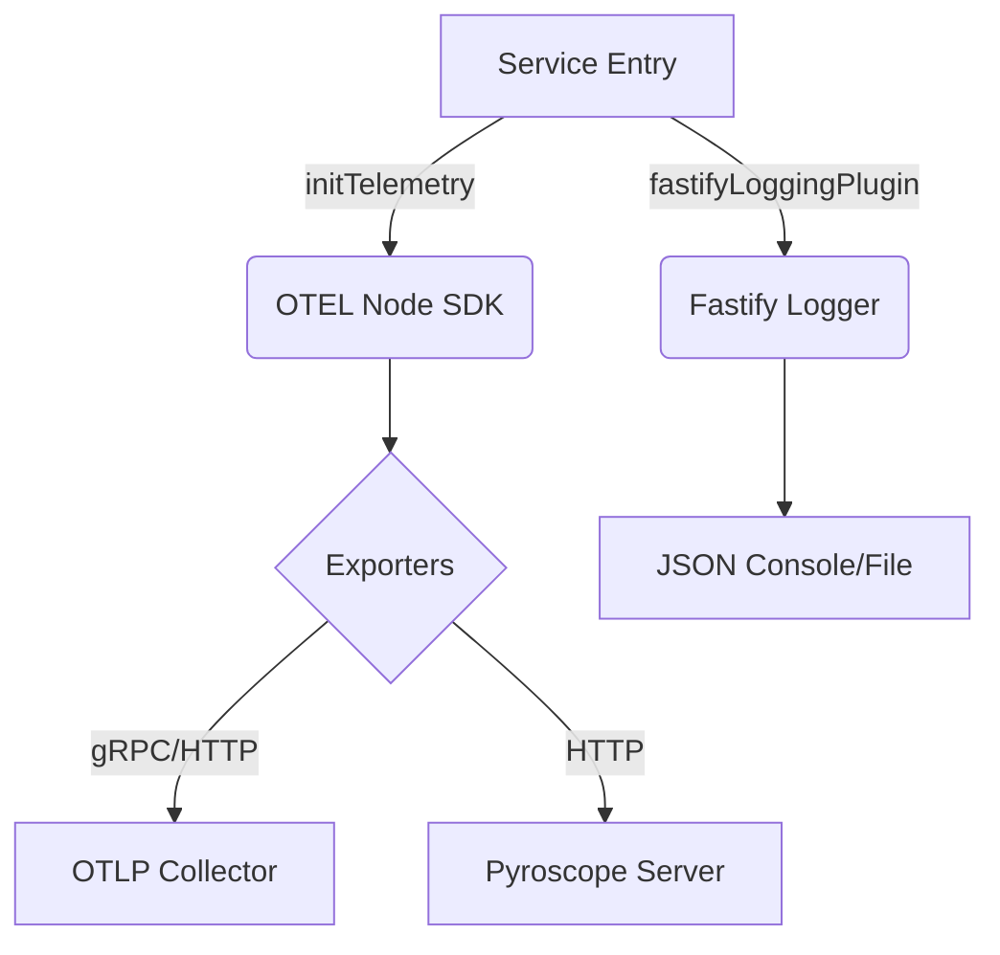

# 🌐 @ztube/observability

[](https://opentelemetry.io/)
[](https://pyroscope.io/)
[](https://www.fastify.io/)

> **The source of truth for visibility.** A corporate-grade observability toolkit designed for high-performance Node.js microservices.

---

## 🚀 Overview

`@ztube/observability` is a unified infrastructure layer that combines **Distributed Tracing**, **Metrics**, **Profiling**, and **Structured Logging** into a single, high-performance package. It is designed to be the foundation of any service within the zTube ecosystem, ensuring that operations are visible, measurable, and debuggable.

### Key Pillars
- **🔭 Distributed Tracing**: Automated OpenTelemetry instrumentation for HTTP, AMQP, MongoDB, Redis, and AWS.
- **📊 Real-time Metrics**: Automatic collection of Host (CPU/Mem) and Runtime (GC/Event Loop) metrics.
- **🔥 Continuous Profiling**: Deep integration with Pyroscope for CPU and Heap profiling with trace-to-profile linking.
- **📜 Structured Logging**: Context-aware logging using Pino, with automatic correlation IDs and trace injection.

---

## 🛠️ Architecture

The package follows a **Modular Infrastructure** pattern, providing specialized adapters for different frameworks while maintaining a unified core.



---

## 📦 Installation

```bash
pnpm add @ztube/observability
```

---

## 📖 Usage

### 1. The "Golden Standard" Initialization
Call `initTelemetry` as early as possible in your application entry point.

```typescript
import { initTelemetry } from "@ztube/observability";

await initTelemetry({
  serviceName: "video-processor",
  serviceVersion: "2.4.0",
  otelEndpoint: "http://otel-collector:4317",
  pyroscopeServerAddress: "http://pyroscope:4040", // Optional: Enables Profiling
  logLevel: "info",
  samplingRatio: 0.1 // Record 10% of traces
});
```

### 2. Context-Aware Tracing
Wrap critical business logic in custom spans. Traces are automatically linked to Pyroscope profiles if profiling is enabled.

```typescript
import { addCustomSpan } from "@ztube/observability";

const data = await addCustomSpan("process-frame", async (span) => {
  span.setAttribute("frame.id", frameId);
  
  // Logic here...
  const result = await processFrame(frameId);
  
  return result;
});
```

### 3. Corporate Logging
The package provides a standardized `Logger` based on Pino, designed for structured logging and high performance.

#### Static Usage (Internal/Global)
Use the exported `Logger` for global or internal logging. It is pre-configured but can be re-configured during initialization.

```typescript
import { Logger } from "@ztube/observability";

Logger.logInfo("Operation started", { userId: "123" });
Logger.logWarning("Resource limit nearing", { limit: 80 });

try {
  // ...
} catch (error) {
  Logger.logError("Failed to process request", error, { flowId: "abc" });
}
```

#### Instance Management
For services that require dependency injection or child loggers with specific context:

```typescript
import { LoggerManager } from "@ztube/observability";

const logger = LoggerManager.create({ serviceName: "media-worker", level: "debug" });

// Create a child logger for a specific request/context
const childLogger = logger.createChild({ traceId: "xyz-789" });
childLogger.logInfo("Processing chunk");
```

### 4. Fastify Premium Logging
Enable high-performance, structured logging for your Fastify services.

```typescript
import { fastifyLoggingPlugin } from "@ztube/observability/fastify";

server.register(fastifyLoggingPlugin, {
  serviceName: "api-gateway",
  level: "debug"
});
```

---

## ⚙️ Configuration

| Option | Type | Default | Description |
| :--- | :--- | :--- | :--- |
| `serviceName` | `string` | **Required** | The name identifier for the service. |
| `serviceVersion` | `string` | `1.0.0` | Semantic version of the service. |
| `otelEndpoint` | `string` | **Required** | OTLP gRPC endpoint (e.g., Aspire, Jaeger). |
| `pyroscopeServerAddress` | `string` | `undefined` | Server address for continuous profiling. |
| `logLevel` | `string` | `info` | Minimum log level (trace, debug, info, warn, error). |
| `samplingRatio` | `number` | `1.0` | Probability of sampling a trace (0 to 1). |

---

## 🚨 HttpError

The `HttpError` class lives in this package (`@ztube/observability/fastify`) — not the consuming app — because `fastifyLoggingPlugin`'s `onError` hook needs to recognize the shape without a circular dep. Import via the subpath:

```ts
import { HttpError } from "@ztube/observability/fastify";

throw new HttpError({
    statusCode: 503,
    message: "render queue unavailable",
    expose: true,
    cause: brokerErr,
    details: { attempts: 3 },
});
```

**HTTP-only scope.** `HttpError` is for HTTP responses. Do not throw it from AMQP consumers, worker code, or background jobs — `statusCode` is meaningless there. Use plain `Error` subclasses for non-HTTP failure paths and translate to `HttpError` at the controller boundary.

**Log shape.** When a route throws `HttpError`, the log line carries `err.statusCode`, `err.expose`, `err.details`, and `err.cause` (inlined into the stack) under the `err.*` namespace via Pino's `stdSerializers.err`. Dashboards and alerts can key on these. The `onError` hook duck-types on `statusCode`, so Fastify-native validation errors (`FastifyError`) also log the correct `400` without a special case.

**Response shape.** The consuming app's `setErrorHandler` decides the wire format. The reference handler in `@video-editor/server` replies with `{ error: err.expose ? err.message : "Internal error" }` — `details` is intentionally log-only and never serialized.

---

## 🧪 Development & Testing

We maintain a strict quality gate for observability infrastructure.

```bash
# Build the package
pnpm build

# Run critical test suites
pnpm test

# Launch test UI for visual debugging
pnpm test-ui
```

---

## 🛡️ License
Proprietary. © Daniel Rispler / zTube Monorepo.
