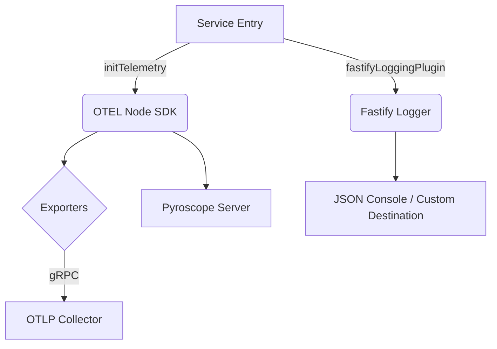

# 🌐 @ztube/observability

[](https://opentelemetry.io/)
[](https://pyroscope.io/)
[](https://www.fastify.io/)

> **The source of truth for visibility.** A corporate-grade observability toolkit designed for high-performance Node.js microservices.

---

## 🚀 Overview

`@ztube/observability` is a unified infrastructure layer that combines **Distributed Tracing**, **Metrics**, **Profiling**, **Structured Logging**, and **Stage Monitoring** into a single, high-performance package. It is designed to be the foundation of any service within the zTube ecosystem, ensuring that operations are visible, measurable, and debuggable.

### Key Pillars
- **🔭 Distributed Tracing**: Auto OpenTelemetry instrumentation for HTTP, Fastify, AMQP, AWS SDK, MongoDB, Redis, and Pino logs.
- **📊 Real-time Metrics**: Host (CPU/Mem) and Runtime (GC/Event Loop) metrics collected every 5 s and shipped via OTLP gRPC.
- **🔥 Continuous Profiling**: Optional Pyroscope integration with automatic `trace_id`/`span_id`/`profile_id` linking.
- **📜 Structured Logging**: Pino-based logger with ISO timestamps, `err` serializer, and auto-injected trace IDs.
- **⛓️ Stage Monitoring**: `ZMonitor` for process-stage lifecycle logs with monotonic-clock duration.

---

## 🛠️ Architecture

The package follows a **Modular Infrastructure** pattern, providing specialized adapters for different frameworks while maintaining a unified core.



Two entry points are published:

| Subpath | Purpose |
|---|---|
| `@ztube/observability` | Telemetry init, tracing helpers, `Logger`, `LoggerManager`, `createZMonitor` |
| `@ztube/observability/fastify` | `fastifyLoggingPlugin`, `HttpError`, route-level log config types |

---

## 📦 Installation

```bash
pnpm add @ztube/observability
```

---

## 📖 Usage

### 1. The "Golden Standard" Initialization

Call `initTelemetry` as early as possible in your application entry point (before any other imports that need to be instrumented).

```typescript
import { initTelemetry } from "@ztube/observability";

initTelemetry({
  serviceName: "video-processor",
  serviceVersion: "2.4.0",
  otelEndpoint: "http://otel-collector:4317",
  pyroscopeServerAddress: "http://pyroscope:4040", // optional — enables profiling
  logLevel: "info",
  samplingRatio: 0.1, // record 10% of traces
});
```

> [!NOTE]
> `initTelemetry` also installs `SIGTERM` / `SIGINT` shutdown hooks that flush the NodeSDK exporters before the process exits.

### 2. Context-Aware Tracing

Wrap critical business logic in custom spans. Spans are automatically linked to Pyroscope profiles when profiling is enabled.

```typescript
import { addCustomSpan, isSampled } from "@ztube/observability";

const data = await addCustomSpan("process-frame", async (span) => {
  span.setAttribute("frame.id", frameId);

  // guard expensive attribute/log work behind the sampler
  if (isSampled()) {
    span.setAttribute("frame.debug", JSON.stringify(debugInfo));
  }

  return processFrame(frameId);
});
```

Exceptions thrown inside the callback are recorded on the span (`recordException` + `SpanStatusCode.ERROR`) and re-thrown.

For non-Fastify HTTP servers, attach `pyroscopeMiddleware` to each request to propagate profile labels:

```typescript
import { pyroscopeMiddleware } from "@ztube/observability";
expressApp.use(pyroscopeMiddleware);
```

`fastifyLoggingPlugin` registers it for you when `enableProfiling: true`.

### 3. Corporate Logging

The package provides a standardized `Logger` based on Pino. ISO timestamps, numeric levels, and the Pino `err` serializer are configured by default.

#### Static Usage (Internal / Global)

```typescript
import { Logger } from "@ztube/observability";

Logger.logInfo("Operation started", { userId: "123" });
Logger.logWarning("Resource limit nearing", { limit: 80 });

try {
  // ...
} catch (error) {
  Logger.logError("Failed to process request", error, { flowId: "abc" });
}
```

`initTelemetry` reconfigures this singleton with the `serviceName` + `logLevel` you pass it.

#### Child loggers

`Logger` is a `LoggerPort` (the public interface — the underlying `LoggerManager` class is internal). Use `createChild` to spawn a request- or job-scoped logger with bound metadata:

```typescript
import { Logger, type LoggerPort } from "@ztube/observability";

const childLogger: LoggerPort = Logger.createChild({ traceId: "xyz-789" });
childLogger.logInfo("Processing chunk");
```

For DI containers, depend on the `LoggerPort` type and inject `Logger` (or a `createChild` of it) at composition root.

### 4. Stage / Process Monitoring

`createZMonitor` wraps `LoggerManager` with a stage lifecycle and monotonic-clock duration. Use it to instrument discrete steps of a pipeline or background job.

```typescript
import { createZMonitor } from "@ztube/observability";

const monitor = createZMonitor({
  processName: "render-job",
  stageName: "encode",
  businessId: jobId,
});

monitor.logStarted();
try {
  const out = await encode();
  monitor.logSuccess(out);
} catch (err) {
  monitor.logAborting(err as Error);
}
```

Every log line includes `processName`, `stageName`, `businessId`, `status`, and `durationMs` (computed from `process.hrtime.bigint()` since `logStarted()`). Available lifecycle calls: `logStarted`, `logSuccess`, `logRetry`, `logAborting`, `logInvalidInput`.

### 5. Fastify Premium Logging

Enable structured request/response logging for your Fastify services.

```typescript
import { fastifyLoggingPlugin } from "@ztube/observability/fastify";

server.register(fastifyLoggingPlugin, {
  enableByDefault: true,
  logStarted: false,
  logSuccess: true,
  enableProfiling: true,
});
```

#### Plugin options

| Option | Type | Default | Description |
| :--- | :--- | :--- | :--- |
| `enableByDefault` | `boolean` | `false` | Log HTTP for every route unless `routeOptions.config.logHttp === false`. |
| `logStarted` | `boolean` | `false` | Emit a log line when each request starts. |
| `logSuccess` | `boolean` | `true` | Emit a log line on successful response. |
| `enableProfiling` | `boolean` | `false` | Register `pyroscopeMiddleware` as an `onRequest` hook. |

#### Per-route override

Attach a `RouteLogConfig` to `routeOptions.config` to override the global defaults for a single route.

```typescript
server.get("/health", {
  config: {
    logHttp: false,
    message: "health-check",
  } satisfies RouteLogConfig,
}, healthHandler);
```

| Field | Type | Purpose |
| :--- | :--- | :--- |
| `logHttp?` | `boolean` | Override `enableByDefault`. |
| `logStarted?` | `boolean` | Override global `logStarted`. |
| `logSuccess?` | `boolean` | Override global `logSuccess`. |
| `selectFields?` | `(ctx: LogSelectingContext) => Record<string, unknown>` | Pick extra fields per `LOG_PHASE` (`STARTED` / `SUCCESS` / `ERROR`). |
| `message` | `string` | Log message; falls back to the handler's function name + phase. |

#### Sampling-aware logging

`fastifyLoggingPlugin` and `ZMonitor` both skip non-error log lines when the active span is **not** recording — i.e. when the trace was dropped by `samplingRatio`. **Errors always log**, regardless of sampling. This keeps your hot path quiet under heavy sampling while guaranteeing failure visibility.

---

## ⚙️ Configuration

`ZOtelConfig` (passed to `initTelemetry`):

| Option | Type | Default | Description |
| :--- | :--- | :--- | :--- |
| `serviceName` | `string` | **Required** | Service identifier (`service.name` resource attribute). |
| `serviceVersion` | `string` | **Required** | Semantic version (`service.version` resource attribute). |
| `otelEndpoint` | `string` | **Required** | OTLP gRPC endpoint for traces + metrics (e.g. `http://otel-collector:4317`). |
| `pyroscopeServerAddress` | `string` | `undefined` | Pyroscope address; if omitted, profiling is disabled. |
| `logLevel` | `string` | `process.env.LOG_LEVEL` ⇒ `"info"` | Pino log level. |
| `samplingRatio` | `number` | `1.0` | Trace sampling probability (0–1) via `TraceIdRatioBasedSampler`. |

`ZBaseConfig` (consumed internally by the `Logger` singleton and by `createZMonitor`):

| Option | Type | Default | Description |
| :--- | :--- | :--- | :--- |
| `serviceName` | `string` | `undefined` | Pino `base.serviceName` field. |
| `level` | `string` | `process.env.LOG_LEVEL` ⇒ `"info"` | Pino log level. |
| `customDestination` | `pino.DestinationStream` | `pino.destination(1)` (stdout) | Custom destination — useful in tests. |

> [!TIP]
> When `LOG_LEVEL` is set in the environment, both the `Logger` singleton and any `createZMonitor` instance pick it up automatically.

---

## 🚨 HttpError

The `HttpError` class lives in this package (`@ztube/observability/fastify`) — not the consuming app — because `fastifyLoggingPlugin`'s `onError` hook needs to recognize the shape without a circular dep. Import via the subpath:

```ts
import { HttpError } from "@ztube/observability/fastify";

throw new HttpError({
    statusCode: 503,
    message: "render queue unavailable",
    expose: true,
    cause: brokerErr,
    details: { attempts: 3 },
});
```

**HTTP-only scope.** `HttpError` is for HTTP responses. Do not throw it from AMQP consumers, worker code, or background jobs — `statusCode` is meaningless there. Use plain `Error` subclasses for non-HTTP failure paths and translate to `HttpError` at the controller boundary.

**`expose` default.** When you do not pass `expose`, it is derived from `statusCode`: `true` for 4xx, `false` for 5xx. So 5xx bodies do not leak internal `message`s unless you opt in.

**Log shape.** When a route throws `HttpError`, the log line carries `err.statusCode`, `err.expose`, `err.details`, and `err.cause` (inlined into the stack) under the `err.*` namespace via Pino's `stdSerializers.err`. Dashboards and alerts can key on these. The `onError` hook duck-types on `statusCode`, so Fastify-native validation errors (`FastifyError`) also log the correct `400` without a special case.

**Response shape.** The consuming app's `setErrorHandler` decides the wire format. The reference handler in `@video-editor/server` replies with `{ error: err.expose ? err.message : "Internal error" }` — `details` is intentionally log-only and never serialized.

---

## 🧪 Development & Testing

We maintain a strict quality gate for observability infrastructure.

```bash
# Build the package
pnpm build

# Run the test suite (vitest)
pnpm test

# Type-check
pnpm type-check

# Lint + format (Biome)
pnpm lint

# Run the Fastify OTEL example end-to-end
pnpm example:fastify
```

Example apps live under `src/example/`:
- `monitor-example/` — `createZMonitor` lifecycle demo.
- `otel/fastify/` — full Fastify service with tracing, metrics, profiling, and structured logs.
- `otel/express/` — Express counterpart to demonstrate framework portability.

---

## 🛡️ License
Proprietary. © Daniel Rispler / zTube Monorepo.
