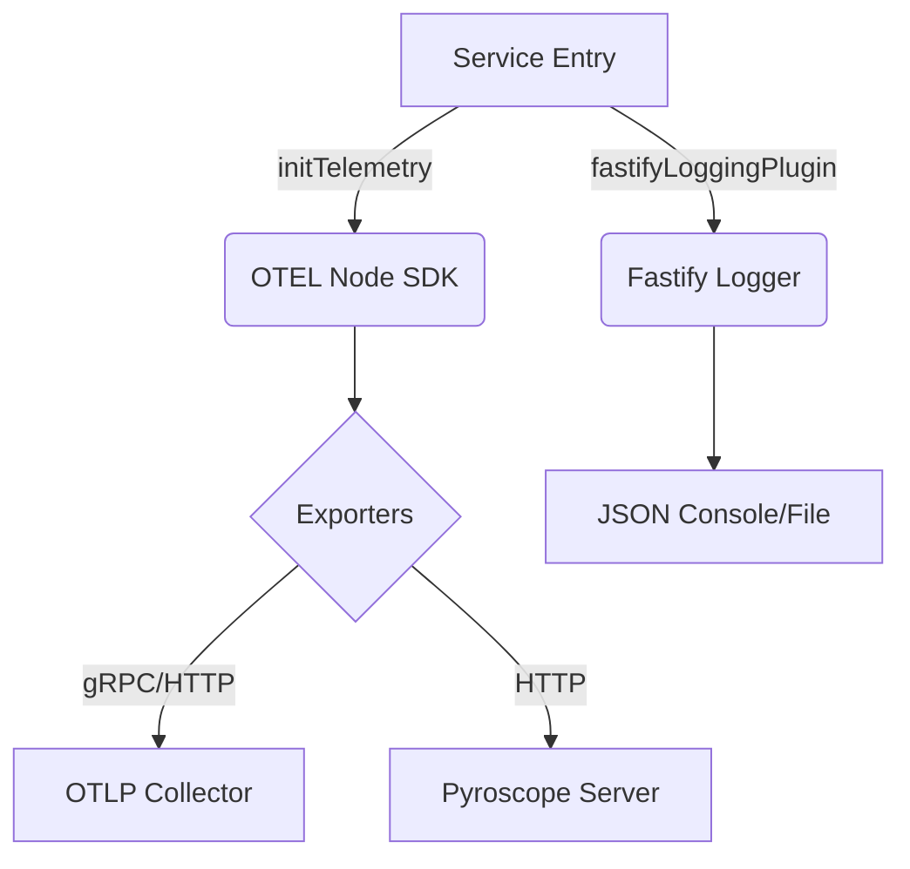

# @ztube/observability

> **מקור האמת לנראות.** ערכת כלי observability ברמת תאגיד שתוכננה ל־microservices של Node.js בעלי ביצועים גבוהים.

---

## סקירה

`@ztube/observability` היא שכבת תשתית מאוחדת שמשלבת **Distributed Tracing**, **מטריקות**, **Profiling** ו**Logging מובנה** לחבילה אחת בעלת ביצועים גבוהים. היא תוכננה להיות הבסיס של כל שירות בתוך אקוסיסטם zTube, ומבטיחה שפעולות נראות, מדידות וניתנות לדיבוג.

### עמודים מרכזיים
- **Distributed Tracing**: אינסטרומנטציה אוטומטית של OpenTelemetry עבור HTTP, AMQP, MongoDB, Redis ו־AWS.
- **מטריקות בזמן אמת**: איסוף אוטומטי של מטריקות Host (CPU/Mem) ו־Runtime (GC/Event Loop).
- **Profiling רציף**: אינטגרציה עמוקה עם Pyroscope ל־profiling של CPU ו־Heap עם קישור trace-to-profile.
- **Logging מובנה**: logging מודע-קונטקסט באמצעות Pino, עם correlation IDs אוטומטיים והזרקת trace.

---

## ארכיטקטורה

החבילה עוקבת אחר דפוס **Modular Infrastructure**, מספקת adapters מתמחים ל־frameworks שונים תוך שמירה על ליבה מאוחדת.



---

## התקנה

```bash
pnpm add @ztube/observability
```

---

## שימוש

### 1. אתחול "תקן הזהב"
קרא ל־`initTelemetry` מוקדם ככל האפשר בנקודת הכניסה של האפליקציה.

```typescript
import { initTelemetry } from "@ztube/observability";

await initTelemetry({
  serviceName: "video-processor",
  serviceVersion: "2.4.0",
  otelEndpoint: "http://otel-collector:4317",
  pyroscopeServerAddress: "http://pyroscope:4040", // Optional: Enables Profiling
  logLevel: "info",
  samplingRatio: 0.1 // Record 10% of traces
});
```

### 2. Tracing מודע-קונטקסט
עטוף לוגיקה עסקית קריטית ב־spans מותאמים אישית. Traces מקושרים אוטומטית ל־profiles של Pyroscope אם profiling מופעל.

```typescript
import { addCustomSpan } from "@ztube/observability";

const data = await addCustomSpan("process-frame", async (span) => {
  span.setAttribute("frame.id", frameId);
  
  // Logic here...
  const result = await processFrame(frameId);
  
  return result;
});
```

### 3. Logging תאגידי
החבילה מספקת `Logger` סטנדרטי המבוסס על Pino, שתוכנן ל־logging מובנה וביצועים גבוהים.

#### שימוש סטטי (פנימי/גלובלי)
השתמש ב־`Logger` המיוצא ל־logging גלובלי או פנימי. הוא מוגדר מראש אך ניתן להגדירו מחדש במהלך האתחול.

```typescript
import { Logger } from "@ztube/observability";

Logger.logInfo("Operation started", { userId: "123" });
Logger.logWarning("Resource limit nearing", { limit: 80 });

try {
  // ...
} catch (error) {
  Logger.logError("Failed to process request", error, { flowId: "abc" });
}
```

#### ניהול Instance
לשירותים שדורשים dependency injection או child loggers עם קונטקסט ספציפי:

```typescript
import { LoggerManager } from "@ztube/observability";

const logger = LoggerManager.create({ serviceName: "media-worker", level: "debug" });

// Create a child logger for a specific request/context
const childLogger = logger.createChild({ traceId: "xyz-789" });
childLogger.logInfo("Processing chunk");
```

### 4. Fastify Premium Logging
הפעל logging בעל ביצועים גבוהים ומובנה לשירותי Fastify שלך.

```typescript
import { fastifyLoggingPlugin } from "@ztube/observability/fastify";

server.register(fastifyLoggingPlugin, {
  serviceName: "api-gateway",
  level: "debug"
});
```

---

## הגדרות

| אפשרות | סוג | ברירת מחדל | תיאור |
| :--- | :--- | :--- | :--- |
| `serviceName` | `string` | **חובה** | שם המזהה של השירות. |
| `serviceVersion` | `string` | `1.0.0` | גרסה סמנטית של השירות. |
| `otelEndpoint` | `string` | **חובה** | endpoint של OTLP gRPC (למשל Aspire, Jaeger). |
| `pyroscopeServerAddress` | `string` | `undefined` | כתובת שרת ל־profiling רציף. |
| `logLevel` | `string` | `info` | רמת log מינימלית (trace, debug, info, warn, error). |
| `samplingRatio` | `number` | `1.0` | הסתברות לדגימת trace (0 עד 1). |

---

## פיתוח ובדיקות

אנו שומרים על שער איכות קפדני לתשתית observability.

```bash
# Build the package
pnpm build

# Run critical test suites
pnpm test

# Launch test UI for visual debugging
pnpm test-ui
```

---

## רישיון
קנייני. © Daniel Rispler / zTube Monorepo.
