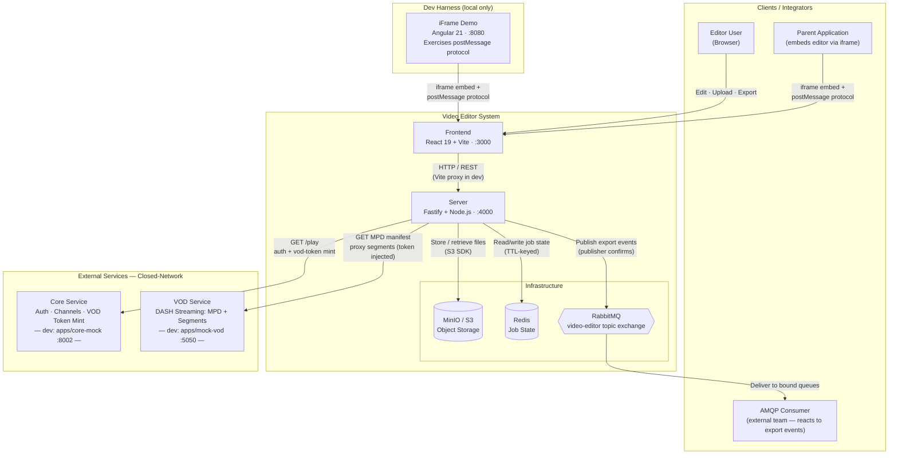
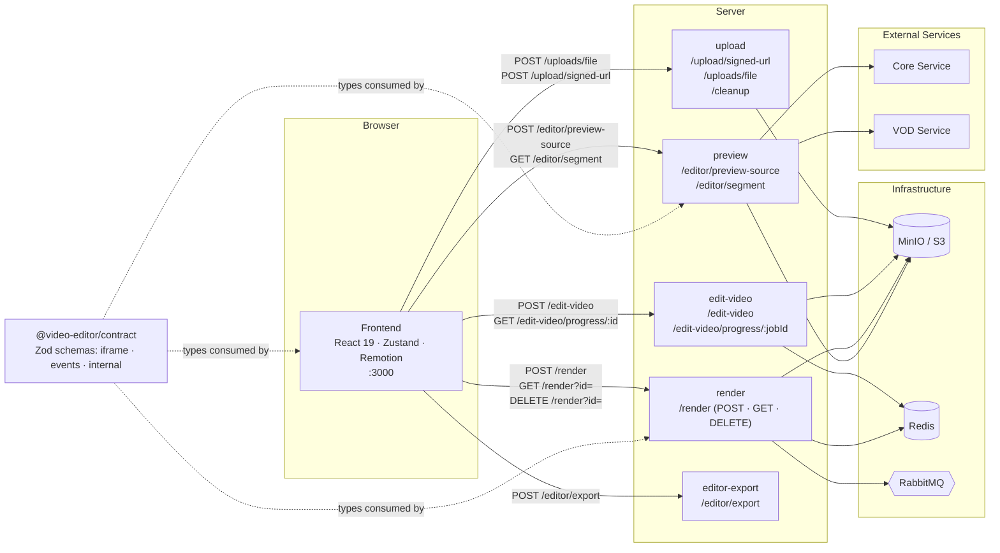
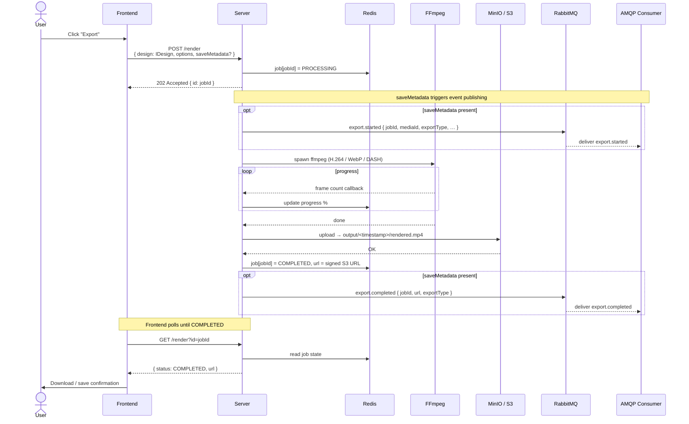
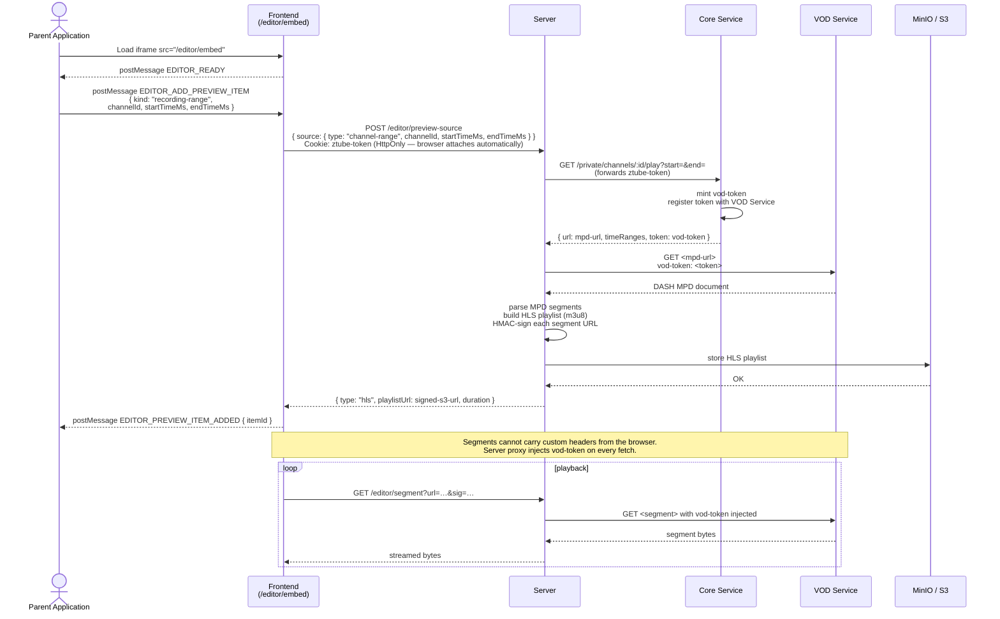
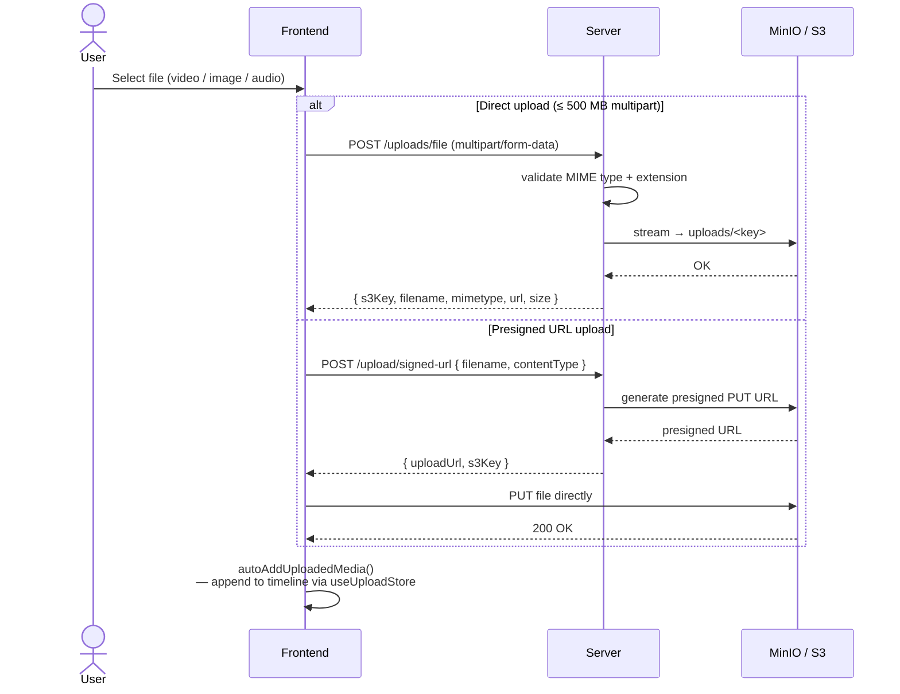
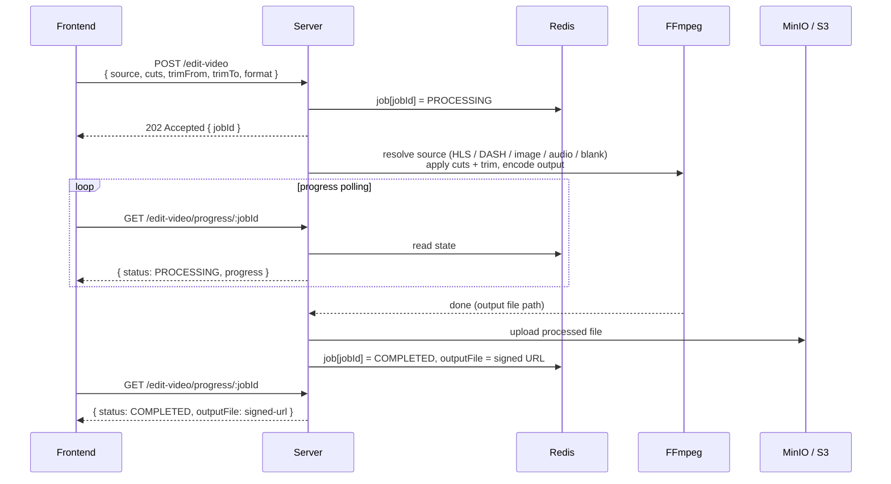
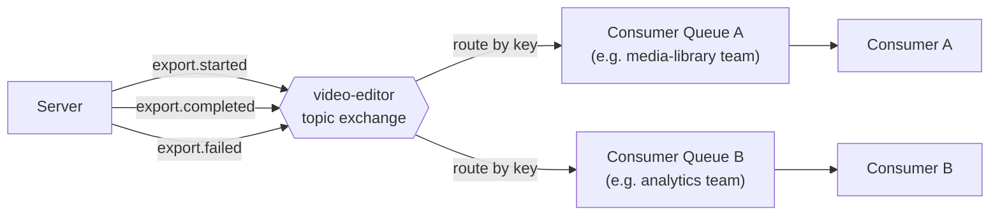
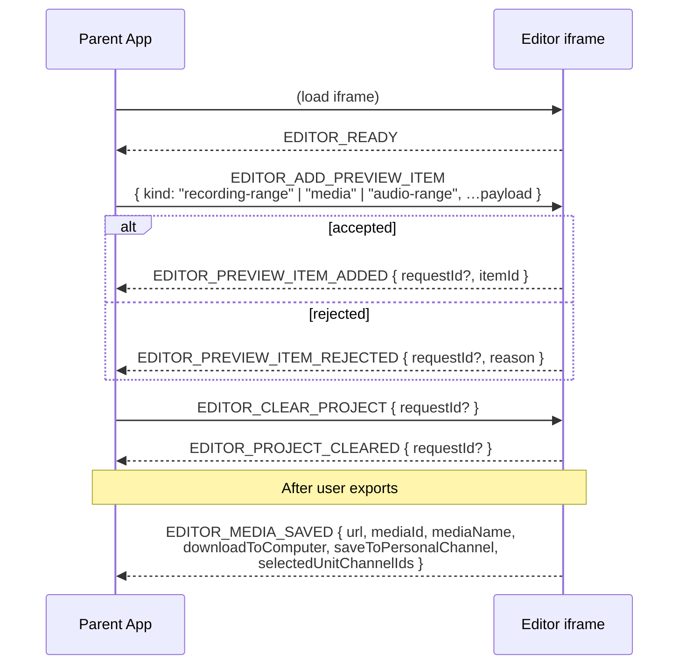

# Video Editor – ארכיטקטורה והפניית זרימה

> הפניה חיה עבור ה־monorepo. עדכן כשהשירותים, ה־routes או זרימות הנתונים משתנים.

---

## 1. סקירת מערכת

התמונה הגדולה: מי מתקשר עם המערכת ודרך אילו ערוצים.



---

## 2. מפת Containers

כל יחידות הפריסה והתלויות הישירות שלהן.



---

## 3. זרימת ייצוא

משתמש מייצא הרכבה → FFmpeg מקודד → קובץ מאוחסן ב־S3 → צוותים חיצוניים מוזמנים דרך AMQP.



---

## 4. זרימת Preview ואינטגרציית iframe

הורה מטמיע את העורך → שולח טווח הקלטה → השרת פותר אותו לתוך HLS playlist ניתן לזרימה → הדפדפן מנגן אותו דרך proxy בצד שרת.



---

## 5. זרימת העלאה

משתמש מעלה קובץ מדיה → נשמר ב־S3 → נוסף לציר הזמן של העורך.



---

## 6. זרימת Edit-Video (job FFmpeg אסינכרוני)

עיבוד חיתוך/גזירה נפרד מרינדור Remotion. מחזיר קובץ מעובד שהעורך יכול להפנות אליו.



---

## 7. חוזה אירועי AMQP

אירועים שמפורסמים ל־topic exchange של `video-editor`. צרכנים חיצוניים קושרים תורים ל־routing keys.



**מבנה המעטפת** (כל האירועים):

```
{
  eventName:     "export.started" | "export.completed" | "export.failed"
  eventVersion:  1
  occurredAt:    ISO-8601 UTC
  traceparent?:  W3C trace context
  data:          { …event-specific payload… }
}
```

AMQP headers משקפים את המעטפת (`x-event-name`, `x-event-version`) לסינון בצד ה־broker בלי לפרסר את הגוף.

---

## 8. חוזה postMessage (הטמעת iframe)

העורך מתארח ב־`/editor/embed`. כל אפליקציית הורה יכולה להטמיע אותו.



**הזדהות:** `ztube-token` הוא HttpOnly — הדפדפן מצרף אותו אוטומטית ב־fetches של same-domain. ההורה לעולם לא קורא או מעביר אותו. שרת העורך קורא אותו מ־header של `Cookie` ומעביר אותו ל־Core.

---

## 9. מדריך החלפת Mock Services → ייצור

| Dev Mock | פורט | שירות אמיתי שמוחלף | מה הוא עושה בייצור |
|---|---|---|---|
| `apps/core-mock` | 8002 | **Core Service** | שירות פלטפורמה מרכזי: זהות משתמש (`/private/users/me`), קטלוג ערוצים מנוהל ו**Channel Play API** (`GET /private/channels/:id/play`) שמטביע VOD Token קצר-מועד ומחזיר את ה־MPD URL לטווח זמן. |
| `apps/mock-vod` | 5050 | **VOD Service** | backend וידאו on-demand: מאמת את ה־VOD Token בכל בקשה, משרת את ה־DASH MPD manifest להקלטה ומזרים את ה־DASH segments הגולמיים (init + media fragments). |

**רשימת החלפה** (שני השירותים):
- הגדר את `CORE_BASE_URL` ב־`apps/server/.env` ל־URL בסיס `/private` האמיתי של Core.
- הסר או עצור את `apps/core-mock` ו־`apps/mock-vod` מ־`docker compose` / `pnpm dev`.
- ודא ש־`ztube-token` מוגדר כ־HttpOnly על ידי אפליקציית ההורה על ה־shared domain.
- ודא ש־TTL של VOD Token תואם או עולה על משך session הצפוי (ברירת מחדל של mock: 10 דקות).
- ודא ש־segment proxy (`/editor/segment`) יכול להגיע ל־host של VOD האמיתי מרשת השרת.

---

## 10. משתני סביבה מרכזיים

| משתנה | שירות | חובה | תיאור |
|---|---|---|---|
| `CORE_BASE_URL` | server | כן | URL בסיס `/private` של Core האמיתי. ברירת מחדל לפיתוח: `http://localhost:8002/private` |
| `PREVIEW_SIGNING_SECRET` | server | כן | סוד HMAC-SHA256 עבור segment proxy (מינימום 32 תווים). מונע SSRF. |
| `QUEUE_URL` | server | כן | URL חיבור AMQP. השרת מסרב להתחיל בלעדיו. `amqps://` מפעיל mTLS — התהליך קורא את `/bundle.pem` ו־`/tmp/certificates/rabbitmq/rabbit_{cert,key}.pem` באתחול. |
| `S3_ENDPOINT` | server | כן | endpoint של MinIO / S3. פיתוח: `http://localhost:9000` |
| `S3_BUCKET` | server | כן | שם bucket. פיתוח: `video-editor` |
| `REDIS_HOST` / `REDIS_PORT` | server | כן | חיבור Redis. ברירות מחדל לפיתוח: `localhost:6379` |
| `SERVER_BASE_URL` | server | כן | URL ציבורי של השרת (בשימוש ב־URLs חתומים של segments). |
| `RENDER_URL_EXPIRY_SECONDS` | server | לא | TTL של URL פלט חתום. ברירת מחדל: `86400` (יום אחד) |
| `JOB_PROGRESS_TTL_SECONDS` | server | לא | TTL של Redis job. ברירת מחדל: `600` (10 דקות) |
| `VITE_EDITOR_PARENT_ORIGINS` | frontend | לא | origins מותרים של iframe מופרדים בפסיקים. ברירת מחדל היא `window.location.origin`. |
