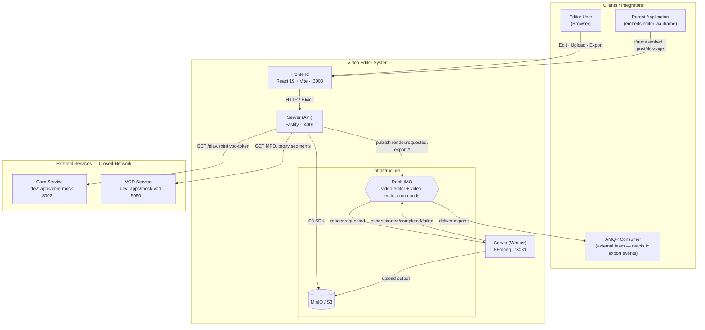
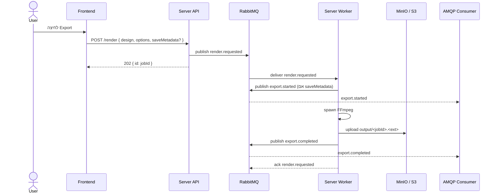
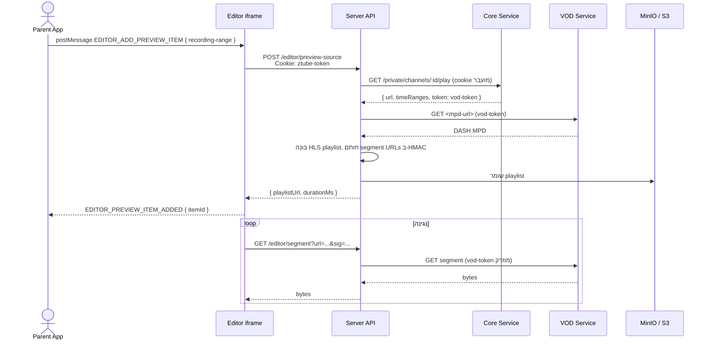

# ארכיטקטורה — סקירה

תרשימי המערכת ושלוש הזרימות העיקריות. פירוט API־י ב-[apps/server](apps/server). פירוט פרוטוקול iframe ב-[integrate/iframe](../integrate/iframe). פירוט אירועים ב-[integrate/events](../integrate/events).

## הקשר מערכת

מי מדבר עם המערכת ודרך אילו ערוצים.

API ו-Worker חולקים image; ה-Worker רץ כ-Deployment נפרד עם entrypoint `src/worker.ts`. ראה [ADR 0005](adr-index).

## זרימת ייצוא

המשתמש לוחץ ייצוא. ה-API מכניס פקודה לתור ויוצא מהדרך — לא ממתין ל-FFmpeg. ה-Worker מבצע, מעלה ל-S3, ומפרסם אירועים.

ה-FE לא עושה polling. אירועים הם ערוץ התוצאה היחיד. מפתח הפלט דטרמיניסטי מ-`jobId`, כך שמסירה חוזרת לא מרנדרת מחדש (idempotency). כשל סופי לאחר 5 ניסיונות: `export.failed { error: "max retries exceeded" }`.

## זרימת Preview (channel range)

ההורה מבקש חלון מהקלטת ערוץ מנוהל. השרת פותר דרך Core ו-VOD ובונה HLS playlist שהדפדפן יכול לנגן ישירות.

הדפדפן לא יכול לצרף `vod-token` ל-segments של HLS. ה-proxy מאמת חתימת HMAC ומזריק את ה-token במעלה הזרם. ה-token עם TTL קצר (כ-10 דקות) — playlists ששמורים יותר מזה ייכשלו ב-401 ויש לייצר אותם מחדש.

עבור mediaId מאוחסן (`EDITOR_ADD_MEDIA`): נתיב שונה — Core משרת segments ישירות תחת עוגיית session, ללא `vod-token`. ראה [ADR 0007](adr-index).

## מקורות

- [docs/architecture.md](https://github.com/Zetro-Crew/video-editor/blob/main/docs/architecture.md)
- [apps/server](apps/server) — כל ה-routes ומשתני env
- [integrate/iframe](../integrate/iframe) — קטלוג הודעות postMessage
- [integrate/events](../integrate/events) — מבנה מעטפת AMQP
